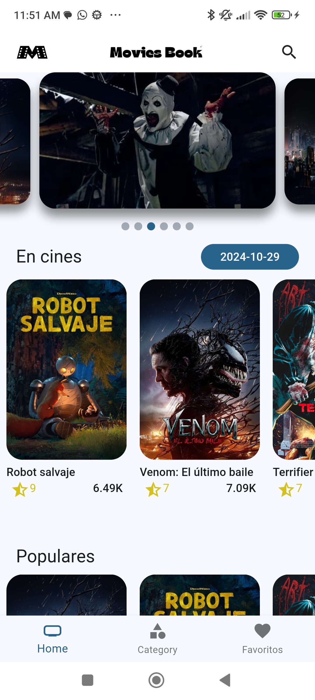
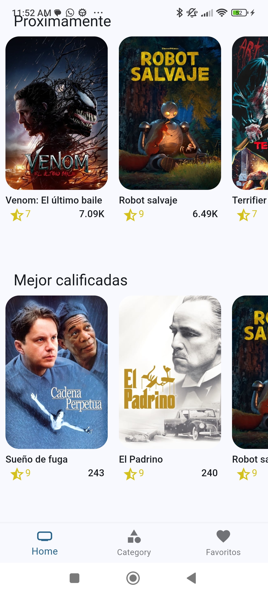
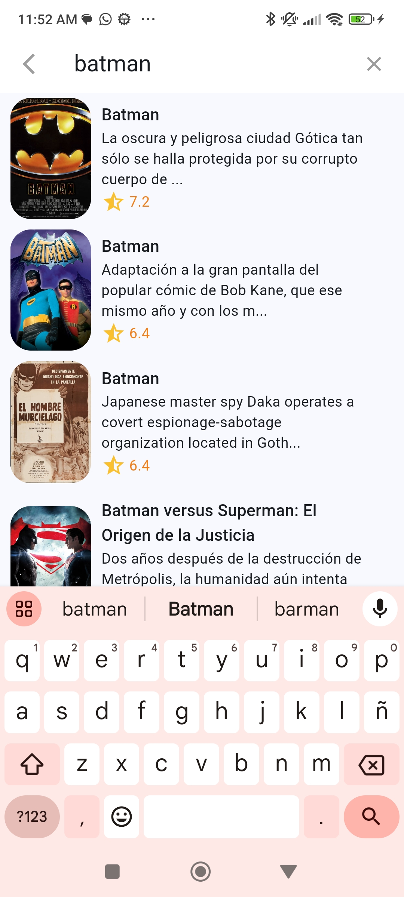
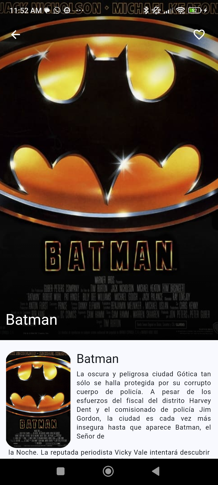
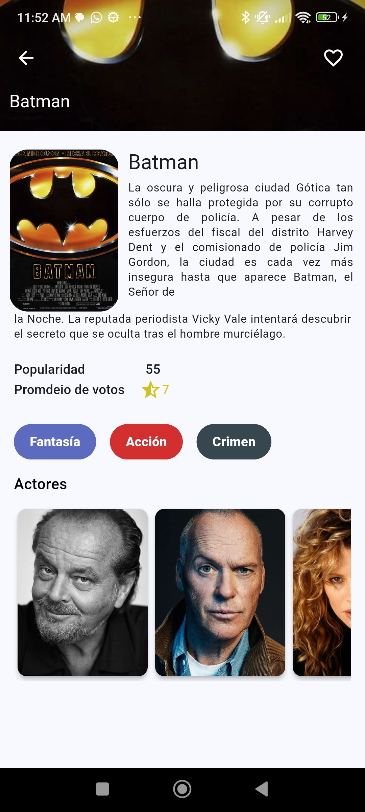
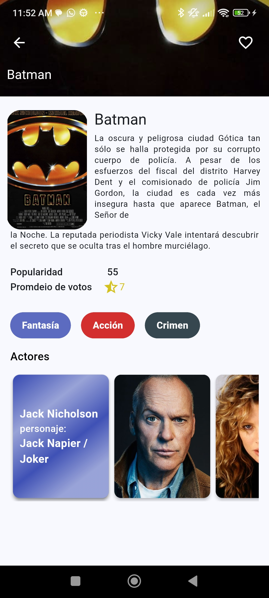
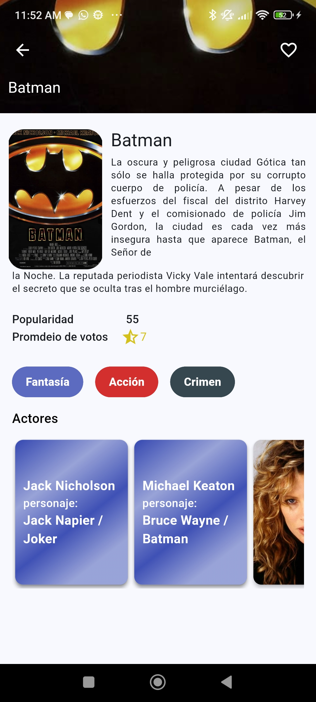
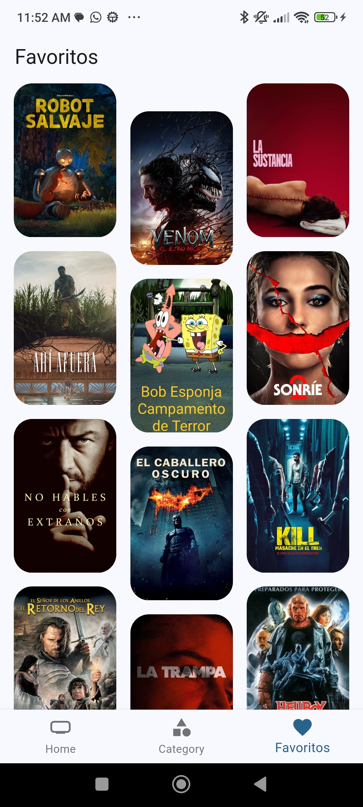

# MoviesBook

## Getting Started

1. Copiar el .env.templatey renombrarlo a .env
2. Cambiar las variables de entorno a una proporcionadas por (The movie db)
3. Cuando se realizen cambios en una entidad se debe ejecutar el comando

```
flutter pub run build_runner build
```
# MoviesBook

#### Descripción

MoviesBook es la aplicación perfecta para los amantes del cine que buscan simplicidad y velocidad. Con MoviesBook, no necesitas registrarte ni iniciar sesión para acceder a un vasto catálogo de películas. Descubre qué películas están en cartelera, cuáles son las más populares y mejor calificadas, y guarda tus favoritas en un apartado especial para verlas en el futuro.

MoviesBook es la app ideal para cinéfilos que valoran el acceso inmediato y sin complicaciones al mundo del cine. ¡Descarga ahora y disfruta de tu próxima película en solo unos clics!


#### Características

- Sin registro ni inicio de sesión: Accede a toda la información de películas al instante, sin barreras.
- Diversidad de categorías: Encuentra películas en cines, populares y las mejor calificadas, con actualizaciones constantes.
- Favoritos sin conexión: Guarda tus películas favoritas en una lista especial y accede a ella en cualquier momento.

#### Implementación

API Rest de TheMovieDB: La app aprovecha los datos detallados y actualizados de TheMovieDB, ofreciendo información completa de cada película.
Gestión de estado con Riverpod: MoviesBook utiliza Riverpod para una experiencia fluida y rápida en la navegación, incluso con múltiples categorías.
Base de datos en el dispositivo con iSAr: Gracias a iSAr, una base de datos no relacional, tus favoritos se guardan de forma segura en tu dispositivo, garantizando una experiencia sin interrupciones incluso sin conexión.


#### Capturas de pantalla

<p align="center">
  
  
  
  
</p>
<p align="center">
  
  
  
  
  
</p>

*Inicio, Buscar, Detalles, Favorito*
